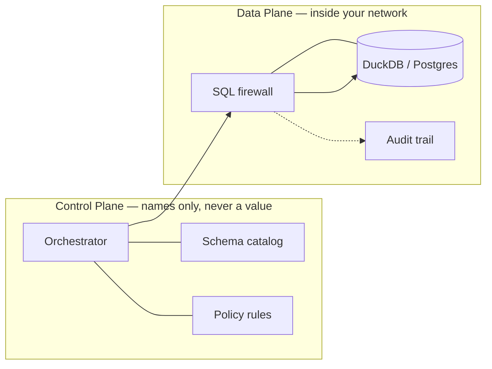

export const metadata = {
  title: "Atlas — an AI data analyst that respects who's allowed to see what",
  description: "Text-to-insight with a fail-closed SQL firewall, per-user scoping, and a tamper-evident audit trail. The raw data never leaves your network.",
  metric: "fail-closed governance · 116 tests green",
  kind: "project",
};

# Atlas — an AI data analyst with a security badge

You point Atlas at a database, ask a question in plain English, and it hands back a chart in seconds. The chart isn't the interesting part. The interesting part is that Atlas refuses to show you data you're not allowed to see — and it does that without the raw data ever leaving your network.

**In plain terms:** everyone can build "chat with your database" in a weekend. The hard part is building one a security team would actually approve. Atlas is my attempt at that: a security-guard librarian standing at the door of your warehouse. It knows the building (schema map), checks your badge (per-user scoping), hides the secrets (masking), writes down everything (audit trail), and — golden rule — never carries books out of the building.

## Try it live

A full deployment runs free on Render: **[atlas-analyst.onrender.com](https://atlas-analyst.onrender.com)** — ask it the demo questions, open the dashboard, and watch every hop land in the audit trail. (Free tier: the instance naps after ~15 minutes idle, so the first load can take ~50 seconds to wake. Coffee's on you.)

The offline brain answers these scripted questions (try pasting them in):

- *"What is the average number of riders going from Airport to Downtown?"*
- *"What is the average salary in each department?"* — as HR you get real numbers; the same question as engineering gets a polite refusal. Try switching the user badge and asking again.
- *"How many trips are there per status?"*
- *"Who is the top driver?"*

## The trap hiding inside the promise

The promise is simple: **no raw data value ever reaches the vendor.** But almost every feature people want quietly breaks it:

| What people want | How it secretly leaks data | How Atlas keeps the promise |
|---|---|---|
| An LLM writes the SQL | If a vendor-hosted LLM sees real rows, the data left the building | The LLM only ever sees **table + column names**, never values — or run your own LLM in your own cloud |
| Charts show up in chat | If the vendor renders the chart, the rows came to the vendor | Charts render **inside your network**; the finished image goes to your browser |
| The agent "peeks at sample data" | Peeking = reading real values | Peeking happens **inside your network**, never across the boundary |

## The big idea: two planes

Atlas splits into a **Control Plane** (the brain — plans, rules, and it only ever sees names) and a **Data Plane** (the hands — runs inside your network, touches data, ships nothing out).

The pieces that make it governance rather than a chatbot:

1. **Fail-closed SQL firewall.** Every generated statement is parsed with `sqlglot` before execution. If the parse says it touches something outside your scope — or can't prove it doesn't — the query is rejected. Fail closed, not open.
2. **Per-user scoping.** A `gokul` in engineering and a `mitra` in HR ask the same question and get different answers — not because the model is clever, but because the firewall only permits what each identity's policy allows.
3. **Masking.** Columns marked sensitive (phone numbers, salaries, PAN numbers) come back masked for roles that shouldn't see them.
4. **Tamper-evident audit trail.** Every question, decision, and table touched lands in an append-only DuckDB audit log. If someone asks "who saw what, when" — there's a receipt.
5. **Bring-your-own brain.** The offline mode ships a deterministic generator that answers the documented demo questions with zero API keys. Plug in Ollama (local) or a cloud LLM for free-form questions — and even then, only schema names cross the boundary.

## Tested, not vibes

The repo carries **116 tests** covering the firewall, scoping, masking, and audit behavior — and I smoke-tested the live server end to end before writing this page:

- asked *"average number of riders going from Airport to Downtown"* → got generated SQL, a real row (`2.5 avg riders`), and a chart back in under a second
- asked an HR-only question as an engineering user → **denied**, politely
- opened the admin dashboard with an engineering key → **blocked** (it requires an `admin` or `audit` role — RBAC doing its job)
- every hop above landed in the audit log with a receipt

## Honest limits

This is a demo/portfolio project and I'd rather tell you the edges than let you find them:

- **No real login yet.** The public demo runs with auth open (`ATLAS_AUTH_MODE=disabled`) so anyone can poke it. For a real deployment switch to `enforced` and mint per-user keys with `atlas-mint-key` — the firewall, scoping, and audit layers are already built for that.
- **The offline brain is deliberately tiny.** Without an LLM it only answers the scripted demo questions — swap in Ollama or a cloud provider for free-form questions.
- **DuckDB/Postgres only** for now. The connector interface is there for more, but that's the honest current surface.

Grab the code at [github.com/GokulArumugam/atlas](https://github.com/GokulArumugam/atlas) — `docker compose up --build` and you're off, or just use the [live demo](https://atlas-analyst.onrender.com).
